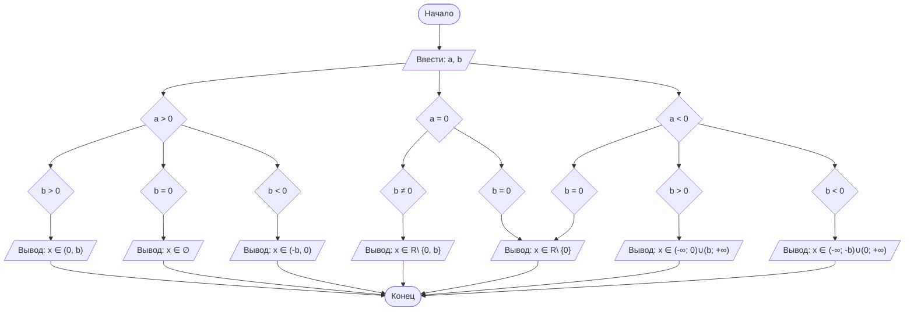

# Отчет по лабораторной работе №1
#### № группы: `ПМ-2502`
#### Выполнила: `Пилуй Анастасия Даниловна`
#### Вариант: `14`

### Содержание:

- [Постановка задачи](#1-постановка-задачи)
- [Входные и выходные данные](#2-входные-и-выходные-данные)
- [Математическая модель](#25-математическая-модель)
- [Выбор структуры данных](#3-выбор-структуры-данных)
- [Алгоритм](#4-алгоритм)
- [Программа](#5-программа)
- [Анализ правильности решения](#6-анализ-правильности-решения)

### 1. Постановка задачи

> Программа получает на вход 2 числа a и b, где a и b — параметры. Нужно решить неравенство a/(x*(b-x))>=0 для x. 

### 2. Входные и выходные данные
   В условии не указан тип входных данных, поэтому будем считать их любыми и 
#### `Данные на вход`

|             | Тип                |
|-------------|--------------------|
| a (Число 1) | Вещественное число |
| b (Число 2) | Вещественное число |

#### `Данные на выход`

Программа выводит значения для x (значение или промежуток/промежутки), при которых неравенство будет выполняться на множестве R (строка + вещественное число).

### 2,5. Математическая модель

Рассмотрим неравенство a/(x*(b-x))>=0. Область определения: x∈R \ {0,b}
Также b ≠ x.

### 3. Выбор структуры данных

На вход программа получает 2 вещественных числа a и b, поэтому для их хранения можно выделить переменные a и b типа double

|             | Название переменной | Тип (в Java) | 
|-------------|---------------------|--------------|
| a (Число 1) |         `a`         |   `double`   |
| b (Число 2) |         `b`         |   `double`   |

Для вывода результата не нужно сохранять его в переменную, он выводится строкой

### 4. Алгоритм

#### Алгоритм выполнения программы:

1. **Ввод данных:**  
   Программа считывает два вещественных числа, обозначенные как `a` и `b`.

2. **Анализ полученных данных:**
   Сначала программа сравнивает с нулем переменную a, потом с b, после чего выполняет определенное действие в зависимости от значений переменных.

3. **Вывод результата:**
   Программа выводит результат опираясь на полученные данные.

   `Зависимость результата от знаков:`

1. Если a > 0:
   - b > 0: x ∈ (0, b)
   - b = 0: x ∈ ∅
   - b < 0: x ∈ (-b, 0)

2. Если a = 0:
   - b ≠ 0: x ∈ R\ {0, b}
   - b = 0: x ∈ R\ {0}
     
3. Если a < 0:
   - b > 0: x ∈ (-∞; 0)∪(b; +∞)
   - b = 0: x ∈ R\ {0}
   - b < 0: x ∈ (-∞; -b)∪(0; +∞)

#### Блок-схема



### 5. Программа

```java

import java.io.PrintStream;
import java.util.Scanner;
public class Main {
    public static Scanner in = new Scanner(System.in);
    public static PrintStream out = System.out;

    public static void main(String[] args) {
        double a = in.nextDouble();
        double b = in.nextDouble();
        if (a > 0) {
            if (b > 0) {
                out.print("x ∈ (0;" + b + ")");
            }
            if (b < 0) {
                out.print("x ∈ (" + b + ";0)");
            }
            if (b==0) {
                out.print("∅");
            }
        }
        if (a == 0) {
            if (b != 0) {
                out.print("x ∈ R \\ {0;" + b + "}");
            } else {
                out.print("x ∈ R \\ {0}");
            }
        }
        if (a<0) {
            if (b > 0) {
                out.print("x ∈ (-∞;0)" + "∪" + "(" + b + ";+∞)");
            }
            if (b < 0) {
                out.print("x ∈ (-∞;" + b + ")" + "∪" + "(0;+∞)");
            }
            if (b == 0) {
                out.print("x ∈ R \\ {0}");
            }
        }
    }
}
```

### 6. Анализ правильности решения

Программа работает корректно на всем множестве решений с учетом ограничений.

1. Тест на `a>0, b>0`:

    - **Input**:
        ```
        5 10
        ```

    - **Output**:
        ```
      x ∈ (0;10.0)
        ```

2. Тест на `a>0, b<0`:

    - **Input**:
        ```
        5.5 -10.7
        ```

    - **Output**:
        ```
        x ∈ (-10.7;0)
        ```

3. Тест на `a<0, b>0`:

    - **Input**:
        ```
        -10 5
        ```

    - **Output**:
        ```
        x ∈ (-∞;0)∪(5.0;+∞)
        ```

4. Тест на `a<0, b<0`:

    - **Input**:
        ```
        -10.2 -7.41
        ```

    - **Output**:
        ```
        x ∈ (-∞;-7.41)∪(0;+∞)
        ```

5. Тест на `a>0, b=0`:

    - **Input**:
        ```
        12 0
        ```

    - **Output**:
        ```
        ∅
        ```

6. Тест на `a<0, b=0`:
    - **Input**:
        ```
        -12 0
        ```

    - **Output**:
        ```
        x ∈ R \ {0}
        ```

7. Тест на `a=0, b≠0`:
    - **Input**:
        ```
        0 5
        ```

    - **Output**:
        ```
        x ∈ R \ {0;5.0}
        ```
  
8. Тест на `a=0, b=0`:
    - **Input**:
        ```
        0 0
        ```

    - **Output**:
        ```
        x ∈ R \ {0}
        ```
